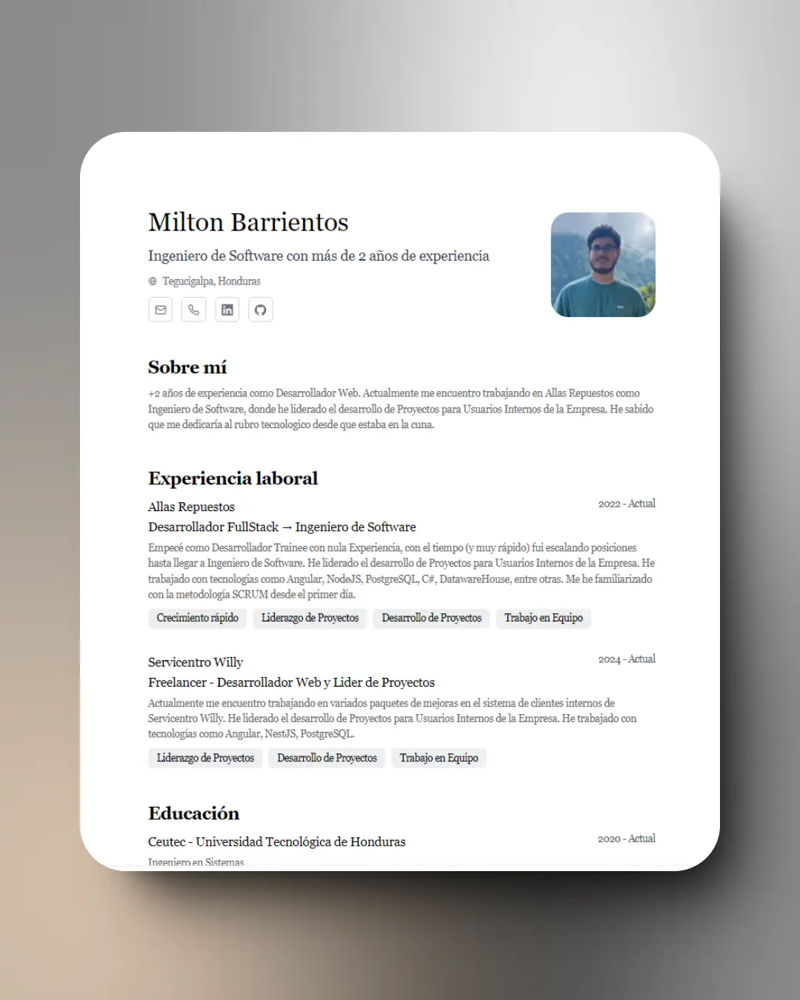

<div align="center">

<h2>
    Portafolio/CV de Milton Barrientos
</h2>

<p>

Esquema del JSON de CV de
<a href="https://jsonresume.org/schema/">
jsonresume.org
</a>
</p>

<p>
Basado en el repositorio de <a href="https://github.com/midudev">
Midudev
</a>

</p>

</div>

<div align="center">
    <a href="#🚀-empezar">
        Empezar
    </a>
    <span>&nbsp;✦&nbsp;</span>
    <a href="#🧞-comandos">
        Comandos
    </a>
    <span>&nbsp;✦&nbsp;</span>
    <a href="#🔑-licencia">
        Licencia
    </a>
    <span>&nbsp;✦&nbsp;</span>
    <a href="https://midu.dev">
        Personal
    </a>
   
</div>

<p></p>

<div align="center">


</div>

<div align="center">
    </img>
</div>


## 🛠️ Stack

- [**Astro**](https://astro.build/) - El framework web de la nueva época.
- [**Typescript**](https://www.typescriptlang.org/) - JavaScript con sintaxis de tipado.
- [**Ninja Keys**](https://github.com/ssleptsov/ninja-keys) - Menu desplegable con atajos de teclado hecho en puro Javascript.

## 🚀 Empezar

### 1. Usa este [repo](https://github.com/crywhat7/cv) como _template_ de un proyecto de Astro

```bash
# Inicializa el proyecto
npm create astro@latest -- --template crywhat7/cv
```

### 2. Añade tu contenido:

Edita el archivo `cv.json` para crear tu propio Portafolio/CV imprimible.

### 3. Lanza el servidor de desarrollo:

```bash
# Disfruta del resultado
npm dev
```

1. Abre [**http://localhost:4321**](http://localhost:4321/) en tu navegador para ver el resultado 🚀

## 🧞 Comandos

|      | Comando         | Acción                                                                       |
| :--- | :-------------- | :--------------------------------------------------------------------------- |
| ⚙️    | `dev` o `start` | Lanza un servidor de desarrollo local en `localhost:4321`.                   |
| ⚙️    | `build`         | Comprueba posibles errores y hace un empaquetado de producción en `./dist/`. |
| ⚙️    | `preview`       | Vista previa en local `localhost:4321`                                       |

## 🔑 Licencia

[MIT](LICENSE.txt) - Creado por [**midudev**](https://midu.dev), adaptado por [**crywhat**](https://crywhat.site)
